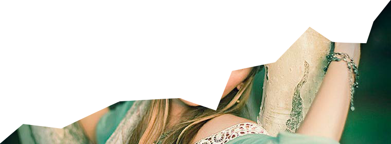

# Parallax-slider
Responsive parallax slider provided by [http://tympanus.net/](http://tympanus.net/codrops/2011/01/03/parallax-slider/) with added functionality.

### Contribute
if you want to contribute to make it a better work you are welcom :)

### example
you can see the slider with the new functionality at my website: [paris-web](www.paris-web.it/slider.html)

##Building it:

html:
```html
	<div id="pxs_container" class="pxs_container">
		<div class="pxs_bg">
			<div class="pxs_bg1"></div>
			<div class="pxs_bg2"></div>
			<div class="pxs_bg3"></div>
		</div>
		<div class="pxs_loading">Loading images...</div>
		<div class="pxs_slider_wrapper">
			<ul class="pxs_slider">
				<li></li>
				**YOUR ORIZZONTAL IMAGE THERE**
			</ul>
			<ul class="pxs_slider2">
				<li></li>
				**YOUR VERTICAL IMAGE THERE**
			</ul>
			<div class="pxs_navigation">
				<span class="pxs_next"></span>
				<span class="pxs_prev"></span>
			</div>
			<ul class="pxs_thumbnails">
				<li></li>
				**YOUR THUMBNAIL IMAGE THERE**
			</ul>
		</div>
		<div class="progress_container">
			<div class="progress_bar1"> <div class="progress" ></div> </div>
			<div class="progress_bar2"> <div class="progress" ></div> </div>
			<div class="progress_barX"> <div class="progress" ></div> </div>
			**YOUR PROGRESSION BAR THERE (increment the class number)**
		</div>
	</div>
```
script:
```html
	<script src='http://ajax.googleapis.com/ajax/libs/jquery/1.xx.xx/jquery.js'></script>
	<script type="text/javascript" src="js/jquery.easing.1.3.js"></script>
	<script src="js/slider.js" type="text/javascript"></script>
```
css:
```html
	<link rel="stylesheet" type="text/css" href="css/pxs_style.css" />
```

start the slider:
```javascript
	var $pxs_container	= $('#pxs_container');
	$pxs_container.parallaxSlider();
```
###Slider option:
    auto            : 5000,	    //how many seconds to periodically slide the content.
                                //If set to 0 then autoplay is turned off.
    speed           : 2500,     //speed of each slide animation
    easing          : 'jswing', //easing effect for the slide animation
    easingBg        : 'jswing', //easing effect for the background animation
    circular        : true,     //circular slider
    thumbnails      : true,     //active the thumbnails
    thumbRotation   : true,     //the thumbs will be randomly rotated
    horizontal      : false     //active only horizzontal slide


# TO DO:
*auto generate progress bar
*progress bar toggle option
*dynamic css for X progress bar
*add next-prev button functionality again(actually only next will work, used in curcular mode), navigation works only with thumbnails
